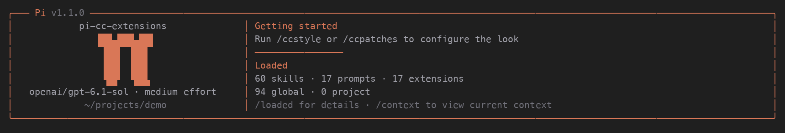

# pi-cc-extension-patches

搭配 `pi-cc-extensions` 使用的个人 UI 补丁包。提供：

- 星形 spinner：`· ✢ ✳ ✶ ✻ ✽` 正序、倒序播放，每帧默认 170ms。
- 每次 `turn_start` 随机选一个动词，例如 `Baking…`、`Crafting…`；同一轮保持不变。
- 保留主插件的 token、耗时和 compact 状态摘要。
- 内置 `claude-dark` 主题：深灰背景、Claude 橙色强调色。
- cc-my-pi 风格双栏启动头：π 入场动画、模型与思考级别、工作目录、已加载资源统计。
- 紧凑用户消息：移除发送后消息的上下 padding，保留背景、左右间距和正文空行。

```text
✳ Baking… (↓ 1,234 tokens · 12s)
```

## 安装

已在 Pi 1.1.0 的原生 `setWorkingIndicator()` API 上验证。旧版缺少此 API 时会提示并跳过。

```bash
pi install git:github.com/KevinZonda/pi-cc-extension-patches
```

然后在 Pi 执行 `/reload`。主插件仍安装 `pi-cc-extensions`；这个包无需安装 `cc-my-pi`。
如果当前装着完整的 `cc-my-pi`，先移除它，避免两个 UI 套件同时接管界面。
spinner 和动词补丁只在 TUI 模式启用，不改变 print/RPC 输出。

## Claude Dark 主题

安装或更新后执行 `/reload`，再通过 `/theme` 选择 `claude-dark`。
也可以在 `~/.pi/agent/settings.json` 中设置：

```json
{ "theme": "claude-dark" }
```

主题由包清单自动注册，无需单独复制到用户的 themes 目录。
配色包含深灰背景、橙色边框与强调色，以及语法高亮、diff、思考级别和 HTML 导出颜色。

## 本地开发

也可以在项目目录里临时加载，退出即结束，不写入安装设置：

```bash
pi -e ./pi-cc-extensions -e ./pi-cc-extension-patches
```

本地开发时，可以克隆后使用绝对路径安装：

```bash
git clone https://github.com/KevinZonda/pi-cc-extension-patches.git
pi install /absolute/path/to/pi-cc-extension-patches
```

## 配置

可选文件：`~/.pi/agent/pi-cc-extension-patches.json`。
设置 `PI_CODING_AGENT_DIR` 时使用该目录。修改后执行 `/reload`。

```json
{
  "headerEnabled": true,
  "compactUserMessages": true,
  "spinnerEnabled": true,
  "verbsEnabled": true,
  "intervalMs": 170,
  "verbs": ["Baking", "Crafting", "Thinking", "Cooking"]
}
```

省略 `verbs` 使用 cc-my-pi 的完整动词列表。空数组也回退到默认列表。
动画速度限制为 50–2000ms。spinner 和动词可以分别关闭。
`/ccpatches` 查看当前配置。

`compactUserMessages` 默认开启，只影响发送后的用户消息，不改变输入框。
设为 `false` 并 `/reload` 可恢复原生上下 padding。补丁在原生 Markdown 结果上只移除
明确添加的 padding 行，正文空行、代码块、图片行以及终端复制区域标记均保留。

## 双栏启动头



左侧显示 π 动画、当前模型、思考级别和工作目录；右侧显示设置入口及 skills、prompts、
extensions 的总数与 global/project 分布。`/loaded` 查看资源名称和主题列表。
主题不计入 global/project 汇总。统计读取当前会话的资源加载器，不再次执行扩展或扫描文件。

补丁启用时接管启动头，主插件无需关闭 `showStartupHeader`，两种加载顺序都只显示一个 header。
将 `headerEnabled` 设为 `false` 并 `/reload`，可恢复主插件的启动头。
终端过窄时隐藏右栏，π 入场动画播放约 1.5 秒后停止。颜色跟随当前主题。

## 实现与维护

动画通过原生 `setWorkingIndicator()` 设置，仅改变工作状态指示器，颜色使用主题 `accent`。
动画定时器由 Pi 管理；每轮重新绑定主题颜色。

动词通过 Loader 显示边界的轻量原型补丁，只替换 working 指示器中开头的
`Working...` / `Working…`。主插件保存的原始文字不会改变，不需要重算 token 或添加刷新计时器。
compact 的 `Running...` 等摘要、重试、压缩和其他加载提示保持原样。
紧凑用户消息依赖 UserMessageComponent 的渲染结构与 Markdown 的内部 padding 字段。
动词依赖 Loader 的内部 `updateDisplay` 方法；启动头接入依赖 InteractiveMode 的内部
`setExtensionHeader` 方法。升级 Pi 时需要验证，目前在 Pi 1.1.0 上验证。

`/reload` 和退出时恢复补丁；所有权检查避免旧实例撤销新实例的补丁。

```bash
npm install
npm run typecheck
npm test
npm run pack:dry-run
```

包可从 GitHub 安装，尚未发布到 npm。主插件源码无需修改。
